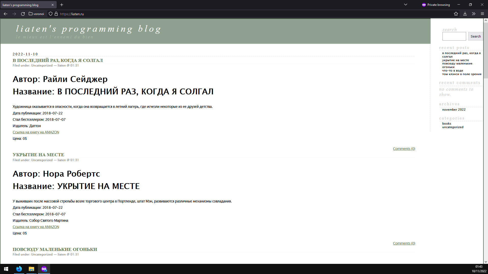

[Ссылка на рабочий сайт](https://liaten.ru)

Исходный файл: 

Спарсенный файл: 

Файл работы с АПИ яндекс клауд: 

Основной файл с парсингом: 

В этом файле я получал все посты из бд: 

В этом файле я заполнял бд из файла: 
